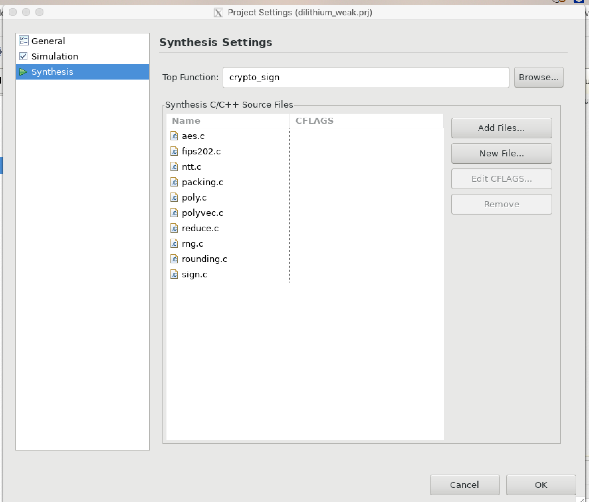
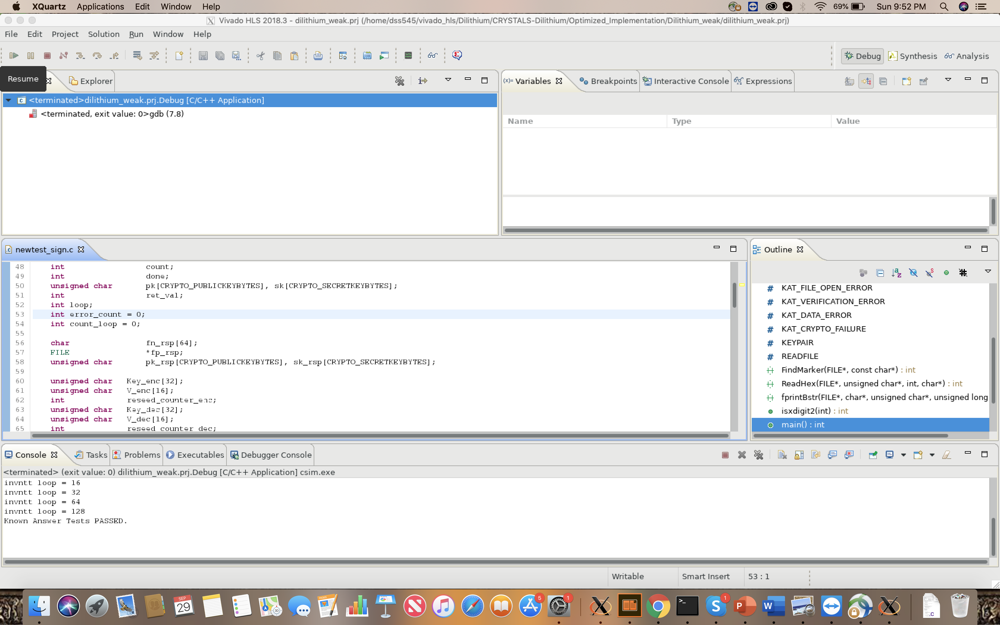

# Hardware Implementation

### Open Project
* Download the github project in the local repository.
* Open the project. The project name ends with (.prj). 
 
* The project has different solutions. Each solution has unique target device, clock period, cosimultation settings, and configuration settings.
 
* For all the solutions, the top module is same. Change or view the top module from, project -> project settings -> synthesis.
 

### C-Simulation 
* The C-simulation is common for all the solution. Run the C-simulation: Project -> Run C Simulation.
 
* We run the C-simulation with debug mode. Simulation does not work on normal mode. Hence, make sure "Launch Debugger" is ticked.
* In the debug mode, run the "Resume(F8)" to start the simulation. If the program works successfully, console shows "Known Answer test PASSED."
 
 

